# Property Management App

https://github.com/jun-tsuno/property_manager_2/assets/110567844/85de17bd-8528-419c-99ac-dfef68a29b00

🚀 https://property-manager-2.vercel.app/

```
Demo Account
email: hoge@example.com
password: password
```

## Why?

Rental housing and shared housing are very widespread in Canada. Some of those owners have multiple homes in various locations, which must be a hassle to manage the renters and whether or not they pay the monthly rent charge. This app is for those who want to smartly handle and manage their properties! No more paper!

## Feature

- Add, Delete, Update house & tenant information.
- Utilize TanStack Query to fetch cached data, and mutate data when it's updated.
- Following SEO practices, optimize images, fonts, and module import so that the app runs efficiently.
- Interact with PostgreSQL database through Prisma ORM.

## Built With

- `Nextjs: 13.4.3`
- `TanStack Qeury(React-Query)`
- `next-auth`
- `TypeScript`
- `PostgreSQL`
- `Prisma`
- `Jest/React Testing Library`
- `zod`
- `shadcn UI`
- `tailwindCSS`

## ER

```mermaid
erDiagram

  "Owner" {
    String id "🗝️"
    String name
    String email
    String password
    DateTime createdAt
    DateTime updatedAt
    }

  "House" {
    String id "🗝️"
    String houseName
    String location
    DateTime createdAt
    DateTime updatedAt
    }

  "Tenant" {
    String id "🗝️"
    String name
    String email
    Int roomId "❓"
    String phone "❓"
    Int fee
    DateTime startDate
    DateTime endDate "❓"
    String avatar "❓"
    DateTime createdAt
    DateTime updatedAt
    }

    "Owner" o{--}o "House" : "house"
    "House" o|--|| "Owner" : "owner"
    "House" o{--}o "Tenant" : "tenant"
    "Tenant" o|--|| "House" : "house"
```



## Challenge

- Figuring out the best approach for using client or server components takes some serious thought. In my strategy, I try to make the top-level page server-components, and set the meta tag on the page.
- Understanding and structuring the React Query required a bit of time. I carefully read the documentation and tried to make the function reusable by using custom hooks.
- I used 'prisma/client' for the type definitions, which allows for secure type casting between database and components.

## Upcoming

- Image upload
- Payment record tracker
