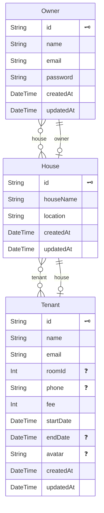

```mermaid
erDiagram

  "Owner" {
    String id "🗝️"
    String name 
    String email 
    String password 
    DateTime createdAt 
    DateTime updatedAt 
    }
  

  "House" {
    String id "🗝️"
    String houseName 
    String location 
    DateTime createdAt 
    DateTime updatedAt 
    }
  

  "Tenant" {
    String id "🗝️"
    String name 
    String email 
    Int roomId "❓"
    String phone "❓"
    Int fee 
    DateTime startDate 
    DateTime endDate "❓"
    String avatar "❓"
    DateTime createdAt 
    DateTime updatedAt 
    }
  
    "Owner" o{--}o "House" : "house"
    "House" o|--|| "Owner" : "owner"
    "House" o{--}o "Tenant" : "tenant"
    "Tenant" o|--|| "House" : "house"
```
